# CFF Deobfuscator — Field Guide

This document explains the obfuscation found in the sample
`FortiEndpoint_Patch.exe` and how our IDA Pro plugin undoes it. It is written
for someone who is new to reverse engineering: you should be able to follow it
even if you have only seen a little assembly before. Terms are defined as we go,
and every example is taken straight from the real binary.

> **How to read the assembly snippets.** Each line looks like
> `140088b80  jmp  rax`. The first part (`140088b80`) is the **address** — think
> of it as the line number of that instruction inside the program. The rest
> (`jmp rax`) is the instruction itself. You do **not** need to memorize x86
> assembly; we explain every instruction that matters.

---

## Part 1 — Anatomy of the obfuscation

### 1.1 What "obfuscation" means here, and why it matters

When a program is compiled, the human-written logic (open a registry key, read a
value, close it) turns into machine instructions that still follow the same
shape: a clear beginning, some branches, and an end. A reverse engineer reads
those instructions — usually through a **decompiler** like Hex-Rays, which turns
machine code back into readable C — to understand what the program does.

**Obfuscation** is a deliberate layer added *on top* of the real logic to make
that reading as painful as possible. The code still does the same thing when it
runs, but it no longer *looks* like what it does. The author of this sample
stacked **four** different obfuscation tricks on top of each other. Our plugin
peels them off in three passes ("layers").

To see how dramatic the effect is, here is one function from the sample,
`reg_read_str`. Its real job is tiny — open a registry key, read a string value,
close the key, with one fallback path. In the untouched binary it looks like
this to IDA:

| `reg_read_str` | Untouched (obfuscated) | After our plugin |
| --- | --- | --- |
| Machine instructions | **2,131** | a few dozen of real logic |
| Basic blocks* | **257** | a handful |
| Edges IDA can draw between blocks | **0** | all of them |
| Decompiler output | dead-ends after 4 lines | clean, readable C |

> \*A **basic block** is a straight run of instructions with no branching in the
> middle — the decompiler stitches blocks together with arrows ("edges") to form
> the function's flow chart. 257 blocks with **zero** edges is the visual
> signature of this obfuscation: a wall of disconnected code fragments.

Here is *all* the decompiler can recover from the untouched function before it
gives up:

```c
void reg_read_str()
{
  __int64 v0; // rax

  v0 = 784;
  if ( *(int *)((char *)off_140307B28 + 0x489B85B10A15A8C7LL) < 10 )
    v0 = 96;
  if ( ((*((_BYTE *)off_140307B20 + 0x489B85B10A15A8C7LL)
       * (*((_BYTE *)off_140307B20 + 0x489B85B10A15A8C7LL) - 1)) & 1) == 0 )
    v0 = 96;
  __asm { jmp     rax }            // <-- decompiler stops dead here
}
```

Four lines and a shrug. Every one of those four lines is actually one of the
obfuscation tricks showing through. Let's name the tricks, then look at each.

### 1.2 The four tricks, in one picture

All four appear together inside a small, repeating chunk of code the obfuscator
sprinkles throughout the function. We call it a **dispatch gadget**. Here is a
real one from `reg_read_str` (at address `140088b40`), annotated:

```asm
; ---- set up once, at the top of the function ----
mov  dword ptr [rbp-...], 0D5FD561Ch    ; (A) STATE = 0xD5FD561C   (a "step number")
mov  r15, 489B85B10A15A8C7h             ; (B) secret KEY #1  (un-hides data addresses)
mov  r13, 782B82E30BD1BC4Fh             ;     secret KEY #2  (un-hides jump targets)

; ---- a dispatch gadget: "where do we go next?" ----
mov  rax, cs:off_140307B20
mov  eax, [rax+r15]                     ; (1) read the current STATE number
lea  edx, [rax-1]                       ; \
imul edx, eax                           ;  } (2) edx = state * (state - 1)
cmp  dword ptr [rcx+r15], 0Ah           ;
mov  eax, 310h                          ;     possible next step "A"
mov  ecx, 60h                           ;     possible next step "B"
cmovl rax, rcx                          ;
test dl, 1                              ; (3) is that product odd?  (it never is)
cmovz rax, rcx                          ;     so this choice ALWAYS happens
add  rax, cs:off_140307B30             ;
mov  rax, [r15+rax]                     ; (4) look up the next address in a hidden table
add  rax, r13                           ; (5) add KEY #2  ->  the real address
jmp  rax                                ; (6) jump there   <-- decompiler can't follow
```

Inside this one gadget:

- **Control-flow flattening** — the function is driven by a **state number**
  (A), and this gadget's whole purpose is to pick the *next* state and jump to
  it. (Trick 1, §1.3)
- **Indirect jumps** — the destination is *computed* at line (6) into a register
  and reached with `jmp rax`, instead of a normal `jmp some_label`. The
  decompiler can't tell where it goes. (Trick 2, §1.4)
- **Opaque predicates** — lines (2) and (3) compute `state * (state - 1)` and
  test whether it is odd. The product of two consecutive numbers is *always*
  even, so the test always has the same answer. It is a fake decision that only
  exists to add noise. (Trick 3, §1.5)
- **Blinded addresses** — notice the program never writes a real address down.
  It stores a *scrambled* value and adds a big secret **key** (B) to unscramble
  it at the last second, at lines (5) and (4). The same trick hides which
  Windows functions get called. (Trick 4, §1.6)

We'll now take them one at a time.

---

### 1.3 Trick 1 — Control-flow flattening

**Normal code** flows like a story: block A leads to B, B decides between C and
D, and so on. If you draw it, you get a branching tree:

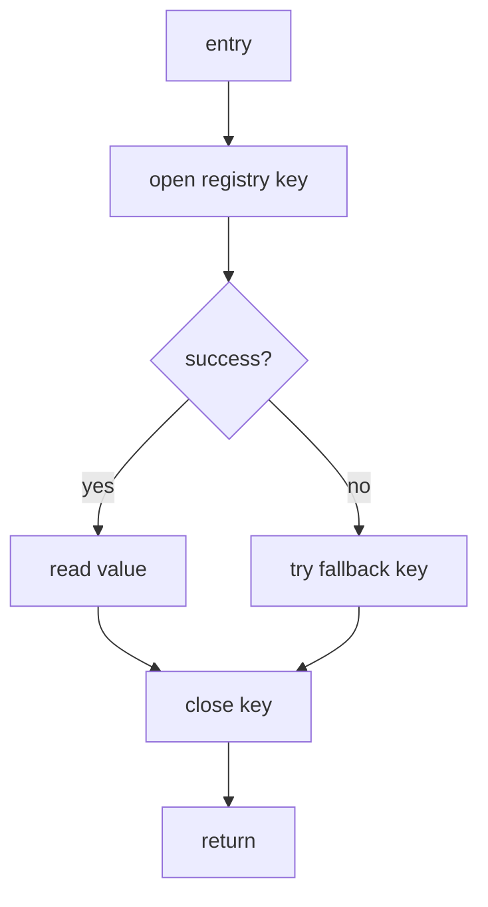

**Flattening** destroys that shape. Every original block is chopped out and laid
flat, side by side, like numbered index cards. A single piece of code — the
**dispatcher** — sits in the middle and decides which card to run next, based on
a **state number** (a plain integer the program keeps in memory). After each
card finishes, it sets the state to the next number and jumps *back* to the
dispatcher. The dispatcher then routes to the next card.

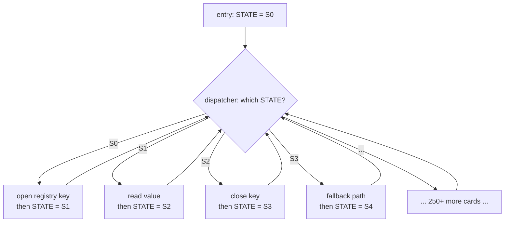

The logic is identical — the same blocks run in the same order at runtime — but
the *shape* is gone. Instead of a readable tree, you get a "hub and spokes": one
dispatcher connected to hundreds of look-alike fragments. That is why
`reg_read_str` ballooned to 257 blocks.

You can see all the moving parts in the real code:

- **The state is created at the top.** In the prologue (the function's setup
  area) the obfuscator writes the starting state number into a memory slot:

  ```asm
  mov  dword ptr [rbp-...], 0D5FD561Ch     ; STATE = 0xD5FD561C
  ```

- **The dispatcher checks the state.** Elsewhere in the function, the dispatcher
  compares the current state against a specific value to decide which card is
  next:

  ```asm
  cmp  eax, 0D7CAE2B0h                      ; is STATE == 0xD7CAE2B0 ?
  jnz  loc_140089BA6                        ; if not, go ask the next question
  ```

  When the state matches, the matching card runs — for example, the block that
  opens the registry key.

- **Each card sets the next state before leaving.** After doing its work, a card
  writes the *next* step number into the state slot and heads back to the
  dispatcher:

  ```asm
  mov  dword ptr [rbp-...], 2E6F8EF5h      ; STATE = 0x2E6F8EF5  (the next step)
  ```

So the "numbers" `784`, `96`, `0xD5FD561C`, `0x2E6F8EF5` you saw in the broken
decompiler output are not real data — they are **step labels** in this hidden
state machine.

> **What our plugin does (Layer 2).** It works out, for every card, which card
> truly comes next, then rewrites the code so each card jumps *directly* to its
> successor — exactly like the original tree — and deletes the dispatcher. The
> flow chart snaps back into shape.

---

### 1.4 Trick 2 — Indirect (computed) jumps

A normal jump names its destination: `jmp loc_140089BA6`. A tool can read that
and draw an arrow. This obfuscator never does that between cards. Instead it
*computes* the destination into a register and jumps to "wherever this register
points":

```asm
mov  rax, [r15+rax]      ; load a scrambled address from a hidden table
add  rax, r13            ; add the secret key -> the real address
jmp  rax                 ; jump to it
```

`jmp rax` means "jump to whatever address is currently in the `rax` register."
Because that value is only known while the program is *running*, a static tool
(one that reads the file without executing it) cannot tell where the arrow goes.
This is exactly why the decompiler printed:

```c
__asm { jmp rax }        // and then stopped
```

It reached the computed jump, had no idea where it led, and gave up — leaving
the other 250-plus blocks stranded with no incoming arrows. That "0 edges" stat
from the table is this trick in action.

> **What our plugin does (Layer 1).** It runs a tiny, safe **simulator** over
> each gadget — it does the same arithmetic the CPU would (`load from table`,
> `add the key`) to figure out the concrete address, then rewrites `jmp rax`
> into a normal `jmp <real address>`. Once the arrows exist, the decompiler can
> see the whole function again. This pass runs *first*, because the other two
> layers need those arrows to do their work.

---

### 1.5 Trick 3 — Opaque predicates

An **opaque predicate** is a question whose answer is fixed in advance, but is
written so a tool can't easily tell. It adds fake branches that look like real
decisions, inflating and confusing the code.

This sample uses one specific, elegant trick. Look again at these lines:

```asm
mov  eax, [rax+r15]      ; eax = some number x
lea  edx, [rax-1]        ; edx = x - 1
imul edx, eax            ; edx = (x - 1) * x
test dl, 1               ; is the lowest bit of edx set?  (i.e. is it odd?)
cmovz rax, rcx           ; if it was even, take this branch
```

The key is `(x - 1) * x`: the product of two **consecutive** whole numbers. One
of any two consecutive numbers is always even, so their product is **always
even**. An even number's lowest bit is always `0`, so `test dl, 1` *always*
reports "even," and the `cmovz` ("conditional move if zero") branch is *always*
taken — no matter what `x` is.

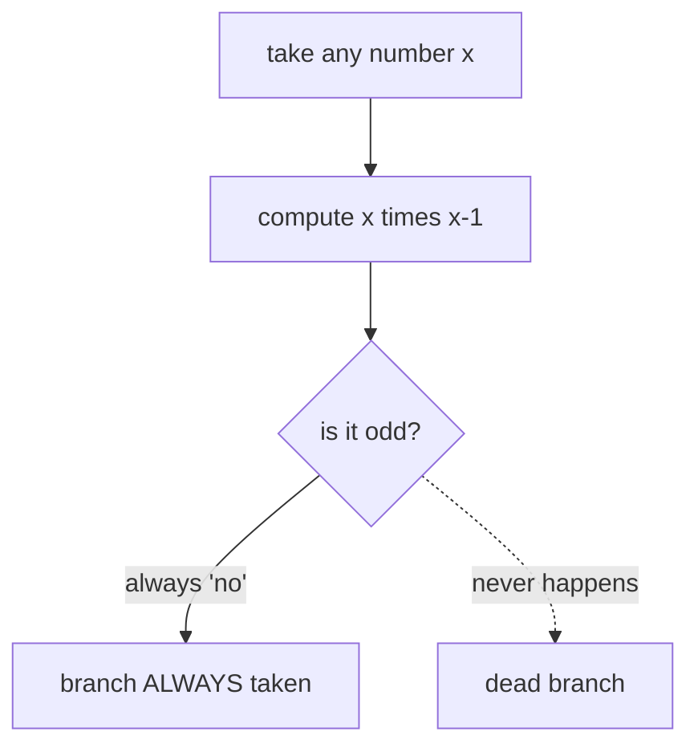

So this "decision" is theatre. It never goes the other way. The obfuscator
scatters these everywhere to make the code look full of branching logic that
isn't really there.

> **What our plugin does (Layer 2).** It recognizes this exact pattern and
> *proves* the branch is one-sided using the math above (not by guessing). It
> then replaces the fake decision with the single path that always runs and
> deletes the dead one. The spurious `if`s disappear from the pseudocode.

---

### 1.6 Trick 4 — Blinded (hidden) API calls

Programs call into Windows to do real work — opening registry keys, reading
files, decrypting data. Normally these calls are easy to spot: the binary has an
**import table** listing functions like `RegOpenKeyExA`, and calls point at
those named entries. That list is a roadmap of what the program can do, so
malware authors love to hide it.

This sample hides every such call behind the same "blinding" scheme it uses for
jump targets. It never stores the real address of a Windows function. Instead it
stores `(real address − secret key)` in a global slot, and adds the key back
right before calling:

```asm
mov  rax, cs:off_140303D20     ; load a SCRAMBLED pointer  (= real - key)
add  rax, rdx                  ; add the secret key  ->  the real function address
...                            ; put the arguments in place
call rax                       ; call it
```

On its own, `call rax` tells you nothing — "call whatever this register points
to." You only learn the destination if you redo the same hidden arithmetic. In
this case the result is `RegOpenKeyExA`, and the surrounding instructions are
setting up its arguments:

```asm
mov  rax, cs:off_140303D20
add  rax, rdx                  ; rax = &RegOpenKeyExA
sub  rsp, 30h
lea  rcx, [rbp-...]
mov  [rsp+...], rcx            ; arg 5: receives the opened key handle
mov  rcx, 0FFFFFFFF80000002h   ; arg 1: HKEY_LOCAL_MACHINE (0x80000002)
mov  rdx, [rbp-...]            ; arg 2: the subkey name to open
xor  r8d, r8d                  ; arg 3: 0
mov  r9d, 20019h               ; arg 4: KEY_READ (0x20019)
call rax                       ; -> RegOpenKeyExA(HKLM, subkey, 0, KEY_READ, &handle)
```

Without help, an analyst sees an anonymous `call rax` and has no idea the
program is touching the Windows registry. The "secret key" here is the same kind
of big constant from the prologue (e.g. `0x489B85B10A15A8C7`).

> **What our plugin does (Layer 3).** It finds these blinded calls, recovers the
> key (it discovers the key constants automatically rather than relying on
> hard-coded values), redoes the arithmetic to get the true target, and writes
> the real name next to the call as a comment — both in the disassembly and in
> the pseudocode:
>
> ```c
> v25 = RegOpenKeyExA(HKEY_LOCAL_MACHINE, a1, 0, KEY_READ, &handle);  // -> RegOpenKeyExA
> ```

---

### 1.7 How the four tricks stack

The reason this sample is hard is that the tricks are not used separately — they
are woven into every gadget at once, and each one *hides* the next:

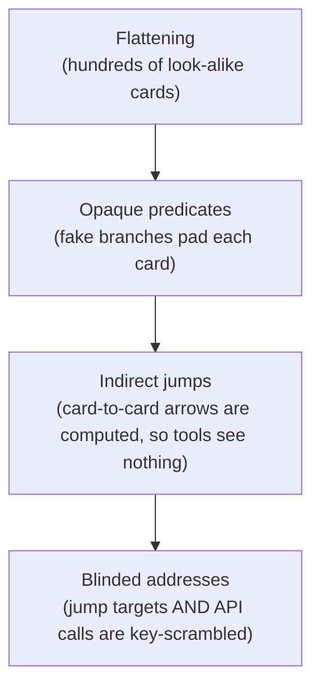

Reading from the analyst's side, the obstacles appear in the opposite order:

1. You open the function and the decompiler **dies at the first `jmp rax`**
   (indirect jump). You can't even see most of the code.
2. Force the code visible and it's a **flat wall of 257 blocks** with no arrows
   (flattening) — you can't follow the logic.
3. Trace the logic and it's **clogged with fake branches** (opaque predicates)
   that lead nowhere.
4. Find the real work and the **Windows calls are anonymous** (`call rax`) — you
   can't tell what it's actually doing.

Our plugin removes them in the order that makes each step possible:

| Pass | Trick removed | Result |
| --- | --- | --- |
| **Layer 1** | Indirect jumps | The arrows reappear; the decompiler can see the whole function |
| **Layer 2** | Flattening + opaque predicates | The hub-and-spokes collapses back into a normal flow chart; fake branches vanish |
| **Layer 3** | Blinded API calls | Every `call rax` is labeled with the real Windows function |

The end result for `reg_read_str` — the same function we started with — is the
clean, readable code our table promised:

```c
__int64 __fastcall reg_read_str(__int64 a1, __int64 a2, __int64 a3, int a4)
{
  ...
  v25 = RegOpenKeyExA(HKEY_LOCAL_MACHINE, a1, 0, KEY_READ, &handle);   // -> RegOpenKeyExA
  if ( v25 != 0 )
    goto LABEL_4;
  ...
  v24 = RegQueryValueExA(handle, ...);                                  // -> RegQueryValueExA
  ...
}
```

From 2,131 instructions of noise back to a handful of lines that say exactly what
the function does.

The next part of this guide explains *how* each layer performs its
transformation, step by step.

---

## Part 2 — How the deobfuscation works

The plugin removes the obfuscation in **three passes**, and the order is not
optional — each pass clears the way for the next:

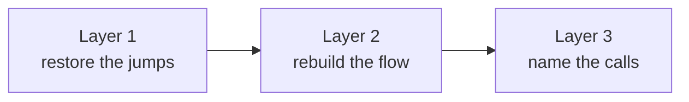

We can actually *measure* why the order matters. If you ask Layer 2 to analyze
`reg_read_str` on the raw, untouched binary — before Layer 1 has run — it finds
the state machine but can follow only **one** block and then stalls:

```
looks_flattened : True
state_reg       : eax
backbone_states : 28
live blocks      : 1        <-- stuck: it can't reach the other 27
```

It's stuck for the obvious reason: the arrows between blocks are still computed
`jmp rax` jumps that nobody has resolved yet. So Layer 1 has to go first.

> **A guiding principle for all three layers: be correct, not clever.** Each
> layer only changes the code when it can *prove* the change is right. When it
> isn't sure, it leaves the code untouched rather than risk a wrong answer. A
> deobfuscator that occasionally lies is worse than useless, so the plugin is
> built to fail safe.

---

### 2.1 Layer 1 — Restoring the jumps (de-indirection)

**The problem.** Every block ends in `jmp rax`, where `rax` was computed by a
little decode gadget. A static tool can't tell where it goes, so the function
falls apart into hundreds of disconnected pieces (§1.4).

**The idea.** The decode gadget is just arithmetic — load a value from a table,
add a key. So the plugin includes a tiny, safe **simulator** (an *emulator*)
that does exactly that arithmetic itself, the same way the real CPU would, but
without running the program. It only needs to understand a handful of
instructions (`mov`, `add`, `lea`, `cmov`, …), and crucially it is **read-only**:
it computes values, it never executes the program's real effects.

**Step by step.** Take the gadget that ends at address `140088b80`:

```asm
mov  rax, cs:off_140307B20
mov  eax, [rax+r15]        ; read the current state number
...                        ; pick an index for this block
add  rax, cs:off_140307B30 ; add the (hidden) table base
mov  rax, [r15+rax]        ; load the scrambled target from the table
add  rax, r13              ; add secret KEY #2  ->  the real address
jmp  rax                   ; go there
```

The emulator:

1. Starts a little earlier (at `140088adc`), where it can see the register
   values the prologue set up — including the keys `r15 = 0x489B85B10A15A8C7`
   and `r13 = 0x782B82E30BD1BC4F`.
2. Walks the gadget instruction by instruction, doing each calculation: read the
   table base, pick the index, look up the scrambled value, add the key.
3. Arrives at a single, concrete answer: the jump goes to **`0x140088c49`**.

That address, `0x140088c49`, turns out to be the **dispatcher** — the central
hub of the flattened machine (it's the block that reads the state number and
decides what runs next). In fact, of the first six gadgets the plugin resolves,
*five* jump straight to `0x140088c49`. That is the "spokes pointing back at the
hub" shape of flattening, now made visible.

For `reg_read_str`, Layer 1 resolves **all 82** of the function's indirect jumps
with **zero** left unresolved.

**The rewrite.** Once the destination is known, the plugin overwrites the now-
useless decode-gadget tail with a normal, direct jump:

```asm
; before                         ; after
jmp rax              ----->      jmp loc_140088C49
```

It only ever overwrites bytes it has proven are dead (the leftover decode
arithmetic that nothing else needs), so the patch can't corrupt real code.

**The outcome.** The arrows are back. IDA can now draw the full flow chart and
the decompiler can read the whole function — though it is still *flattened* (a
hub with 257 spokes). That's Layer 2's job.

---

### 2.2 Layer 2 — Rebuilding the flow (unflattening)

**The problem.** We can now see all the blocks, but they're still arranged as a
flat state machine: a dispatcher in the middle, and every real block looping
back to it after setting the next state number (§1.3). To a human it's still
unreadable.

**The idea.** Re-discover, for every block, which block *truly* comes next, then
wire the blocks directly to each other and throw the dispatcher away.

**Step by step.**

1. **Find the machine's parts.** The plugin locates the **state variable** (here
   it lives in the `eax` register / a stack slot) and the **dispatcher**: a
   tree of comparisons that maps each state number to its block. In
   `reg_read_str` this backbone has **28 states** and **39** comparison nodes.

2. **Resolve one "hop" per block.** Starting from a block, the plugin emulates
   forward — reusing the same safe simulator from Layer 1 — until the block does
   the one thing every block does at the end: write the *next* state number and
   head back to the dispatcher. Two cases come up:

   - **Unconditional** (the original was a straight line): the block writes a
     single constant, e.g.

     ```asm
     mov  dword ptr [rbp-...], 2E6F8EF5h    ; next state = 0x2E6F8EF5
     ```

     → exactly one successor.

   - **Conditional** (the original was an `if`): the block prepares *two* state
     numbers and picks between them with a conditional move driven by a **real**
     test (not a fake one):

     ```asm
     mov  eax, STATE_TRUE
     mov  ecx, STATE_FALSE
     cmp  ...                ; the real condition
     cmovz rax, rcx          ; choose based on the real result
     ```

     → two successors (a genuine branch).

   The simulator tells the two apart by tracking *where each value came from*: a
   choice driven by the state slot or the keys is fake (an opaque predicate)
   and is folded away; a choice driven by real program data is a true branch and
   is kept. This is what keeps the recovered flow chart honest.

3. **Fold the fake branches.** The parity gadget from §1.5
   (`(x-1)*x` is always even) is recognized and collapsed to the single path
   that always runs. The dead half is deleted.

4. **Rewrite.** Each block's "set next state + return to dispatcher" tail is
   replaced with a direct jump to its real successor — or, for a genuine branch,
   a normal conditional jump to one successor and a jump to the other. Once every
   live block points straight at the next, the dispatcher has no incoming arrows
   left: it's dead code, and the decompiler drops it.

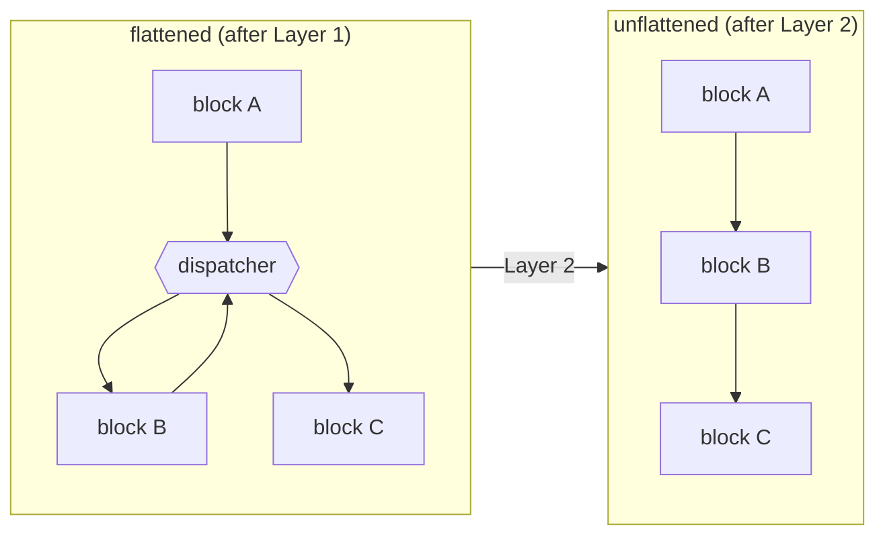

**Correct, not clever (again).** For the trickier "computed-goto" family, the
shared dispatcher stays alive if *any* block is left unresolved, so the plugin
patches such a function only when it can recover it **completely**; otherwise it
leaves it at the (already improved) Layer-1 state rather than produce a
half-rewritten mess. This is why, on a clean run, a handful of the hardest
functions are reported as "skipped" instead of being mangled.

**The outcome.** The hub-and-spokes collapses back into the readable tree from
§1.3, and the spurious `if`s are gone.

---

### 2.3 Layer 3 — Naming the calls (import resolution)

**The problem.** The Windows API calls are blinded: `call rax`, where `rax =
scrambled_pointer + secret_key` (§1.6). The analyst sees anonymous calls and
can't tell the program is touching the registry, the network, or the
filesystem.

**The idea.** Undo the same arithmetic: `real_address = scrambled_value + key`,
then look up which function lives at `real_address`.

**Step by step.**

1. **Find the keys.** The keys are the big 64-bit constants the prologue loads
   into registers (like `0x489B85B10A15A8C7`). The plugin harvests these
   automatically across the binary — nothing is hard-coded — so it adapts to
   whatever keys this particular sample uses.

2. **Resolve each call.** For a blinded call, it reads the scrambled value, adds
   the key, and checks whether the result lands on a known function or an import-
   table entry (the slots IDA labels `p_<API>` or `__imp_<API>`).

3. **Recover the harder keys.** Sometimes the key isn't a simple local constant —
   it's passed in from elsewhere or computed at runtime. For these the plugin
   uses a **family** trick: a candidate key is only accepted if it makes a whole
   *group* of related calls resolve to valid functions at once. A wrong key
   won't satisfy the whole family, so the right one stands out. This recovers
   many calls the simple method misses.

4. **Annotate.** The recovered name is written as a comment next to the call —
   in both the disassembly and the decompiled C.

**Worked example.** The gadget at `140089013`:

```asm
mov  rax, cs:off_140303D20    ; scrambled pointer
add  rax, rdx                 ; + key  ->  real function address
...                           ; arguments: HKLM, subkey, 0, KEY_READ, &handle
call rax
```

resolves to `RegOpenKeyExA`, and the decompiled call becomes:

```c
v25 = RegOpenKeyExA(HKEY_LOCAL_MACHINE, a1, 0, KEY_READ, &handle);   // -> RegOpenKeyExA
```

**Honesty about limits.** A small number of calls use keys that genuinely cannot
be recovered without running the program; the plugin leaves those unlabeled
rather than guess. Correct-not-clever applies here too.

---

### 2.4 Putting it together

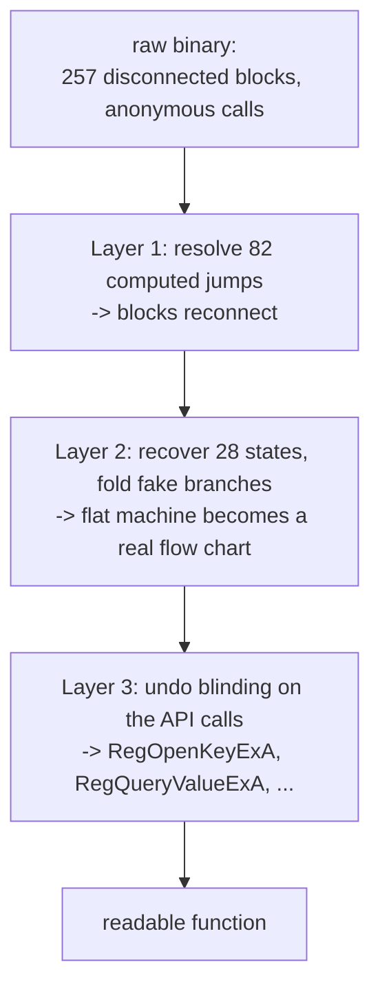

Finally, because each pass permanently edits the database, the plugin records
what it has finished in a hidden marker inside the IDB. If you run it again it
notices the work is already done and stops gracefully instead of patching a
second time; if a run was interrupted, it resumes at the first unfinished layer.
This is what makes it safe to re-run.

The result is the transformation we opened with: `reg_read_str` goes from 2,131
instructions of stacked obfuscation back to a few dozen lines of clear C that say
exactly what it does.

---

## Part 3 — Inside the plugin (implementation details)

Part 2 explained *what* each layer does. This part explains *how* — the actual
machinery, and especially the **messy variants** that make a real-world sample
harder than a textbook example. It is more technical than Parts 1 and 2, but we
still build up from first principles and lean on diagrams. If you only want to
*use* the plugin, you can stop at Part 2; read on if you want to understand,
extend, or trust the code.

The engine lives in three modules under `plugins/ida/cff/`:

| Module | Layer | Job |
| --- | --- | --- |
| `layer1.py` | 1 | Resolve and rewrite computed (`jmp reg`) jumps |
| `layer2.py` | 2 | Recover the flattened state machine and rebuild real control flow |
| `imports.py` | 3 | Undo call blinding and annotate API calls |

We take them in order, because that is the order they must run in (Part 2.1).

---

### 3.1 Layer 1 — `jmp rax` de-indirection

**Recap of the target.** Layer 1 deals with the indirect jump: the function is
chopped into fragments, and each fragment ends with `jmp rax` (or `jmp rcx`,
etc.) where the destination has been *computed* by a little block of arithmetic
called a **decode gadget**. IDA cannot draw the edge because it does not know the
value of `rax` at that point. Our job: figure out that value, then replace the
computed jump with a plain, direct jump that IDA *can* follow.

There are two halves to this: a **resolver** that figures out where each jump
goes, and a **patcher** that rewrites the bytes. The resolver is built on a tiny
CPU emulator, so we start there.

#### 3.1.1 The micro-emulator: a pocket calculator for one register

To know where `jmp rax` goes, we have to *replay* the arithmetic that produced
`rax`. The plugin does this with a deliberately small emulator (`class Emu`).
It is not a full CPU — it only models the handful of operations the obfuscator's
gadgets actually use. That smallness is a feature: less code, fewer ways to be
subtly wrong.

It tracks just two things:

- **16 general-purpose registers** (`rax`, `rcx`, … `r15`), each holding either
  a concrete 64-bit number **or `None`**. `None` means *"I don't know this
  value"* — this is the single most important idea in the whole resolver.
- **The CPU flags** (zero, sign, carry, overflow, parity) — or "unknown" if the
  last flag-setting instruction had an unknown operand.

It understands the gadget vocabulary — `mov`, `lea`, `add`/`sub`/`and`/`or`/
`xor`/`imul`, the shifts, `cmp`/`test`, the conditional moves (`cmov*`), and the
flag-setters (`set*`) — and little else. Three details make it correct on real
code rather than just on paper:

1. **Sub-registers are modeled honestly.** Writing `eax` (32-bit) zeroes the top
   half of `rax`, just like a real CPU; writing `al` or `ax` only touches the
   low byte/word. Getting this wrong would silently corrupt a decode key.

2. **It reads the binary's real bytes.** When a gadget does
   `mov eax, [rax+r15]`, the emulator computes the address (because it knows
   `rax` and `r15`) and *reads the actual bytes out of the IDB*. This is how it
   walks the obfuscator's jump tables: the table contents are baked into the
   file, so a value-based replay reproduces them exactly.

3. **Unknown is contagious, and safe.** Any operation with an unknown input
   produces an unknown output (`None`). An unknown branch condition resolves to
   `None`, not a guess. The emulator would rather say *"I can't tell"* than
   produce a wrong address — a wrong address would mean a wrong patch, which is
   the one outcome we never accept.

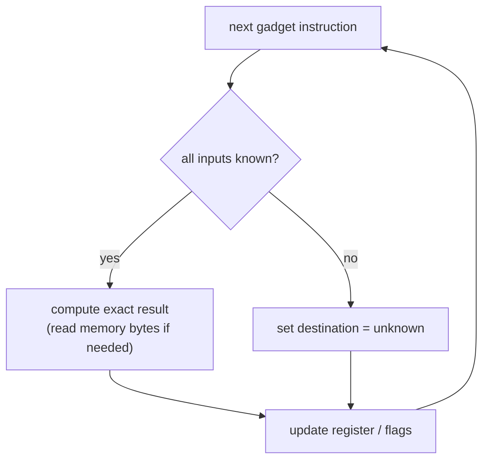

#### 3.1.2 Seeding the keys (`_scan_init`)

The gadgets are driven by **keys**: huge 64-bit constants the function loads once
in its prologue. In `reg_read_str` the prologue does exactly this:

```asm
140088b00  mov  r15, 489B85B10A15A8C7h   ; <- key (base for every table access)
140088b0a  mov  r13, 782B82E30BD1BC4Fh   ; <- key (added to the final address)
140088b14  mov  r12, 7218190CEAADE73Ch   ; <- key
140088b1e  mov  esi, 1C8h                 ; per-state immediates
140088b23  mov  ebx, 378h
140088b28  mov  r14d, 70h
140088b2e  mov  edi, 520h
```

Before resolving anything, the plugin scans the entry region (up to ~120
instructions, stopping at the first indirect jump) and records every
`mov reg, immediate` and `lea reg, global`. Those become the emulator's
**starting register state**. Nothing is hard-coded: whatever constants *this*
function loads are the keys it will use. This is what makes Layer 1 adapt to a
function it has never seen — it learns the keys from the prologue.

#### 3.1.3 Finding the gadget (`gadget_start`)

Given a `jmp rax`, where does the arithmetic that built `rax` begin? The plugin
walks **backwards** from the jump, swallowing instructions as long as they look
like gadget arithmetic (`mov`/`lea`/`imul`/`cmp`/`test`/`cmov`/`set`/…). It also
steps over the obfuscator's in-gadget conditional branches — but only when the
branch jumps *forward, within the gadget* (a tell-tale of an opaque predicate,
not real control flow). The first instruction that does not fit is the gadget
boundary. Emulation then runs forward from there to the jump.

Here is the complete decode gadget for the very first jump in `reg_read_str`,
annotated. **Every one of the four obfuscation tricks from Part 1 is present in
this single block:**

```asm
140088b40  mov   rax, cs:off_140307B20    ; rax = global table pointer A
140088b47  mov   eax, [rax+r15]           ; read a 32-bit "state" word (r15 = key)
140088b4b  mov   rcx, cs:off_140307B28    ; rcx = global table pointer B
140088b52  lea   edx, [rax-1]             ; edx = state - 1
140088b55  imul  edx, eax                 ; edx = state*(state-1)   <-- OPAQUE: always even
140088b58  cmp   dword ptr [rcx+r15], 0Ah ; compare a table word with 10
140088b5d  mov   eax, 310h                ; candidate offset A
140088b62  mov   ecx, 60h                 ; candidate offset B
140088b67  cmovl rax, rcx                 ; pick one based on the cmp
140088b6b  test  dl, 1                    ; low bit of state*(state-1)  -> always 0
140088b6e  cmovz rax, rcx                 ; ZF always set  -> this move is ALWAYS taken
140088b72  add   rax, cs:off_140307B30    ; rax += table base
140088b79  mov   rax, [r15+rax]           ; load the *encoded* destination from the table
140088b7d  add   rax, r13                 ; rax += key  ->  the *real* destination
140088b80  jmp   rax
```

Watch the emulator resolve it. Because `r15`, `r13`, and the table pointers are
all known (keys from the prologue + real bytes from the file), every step
produces a concrete number:

1. `mov eax,[rax+r15]` — address known → read the real state word from the file.
2. `imul edx,eax` after `lea edx,[rax-1]` → `edx = state*(state-1)`. The product
   of two consecutive integers is **always even**, so its low bit is 0.
3. `test dl,1` sets the zero flag (low bit is 0); `cmovz` is therefore **always**
   taken — an opaque predicate the emulator folds away for free, because it
   computed the actual flag.
4. `mov rax,[r15+rax]` reads the encoded target; `add rax,r13` de-blinds it.

The emulator lands on `rax = 0x140088c49`. That is the real successor block.
(Confirmed live: `resolve(0x140088b80) -> 0x140088c49`.)

#### 3.1.4 From one jump to the whole function: the fixpoint analyzer

Resolving a single jump in isolation is the easy case, and the plugin keeps a
simple version of it (`analyze_singleblock`) for debugging. But two messy
realities of real samples break the isolated approach:

- **Cross-block hand-offs.** Some functions don't recompute the decode offset in
  every gadget — one block computes a value, leaves it in a register, and a
  *later* block's gadget consumes it. Resolving blocks in isolation loses that
  register and under-resolves.
- **Dead gadgets.** The false side of an opaque predicate often contains a
  perfectly valid-looking decode gadget that *never actually runs*. Resolving
  every gadget in isolation would happily "resolve" these dead ones too, and we
  could waste patches (or worse) on code that isn't real.

The production resolver (`analyze`) handles both by emulating the function the
way it actually executes: a **worklist that carries register state along the
edges** of the control-flow graph, run to a **fixpoint** (until nothing changes).

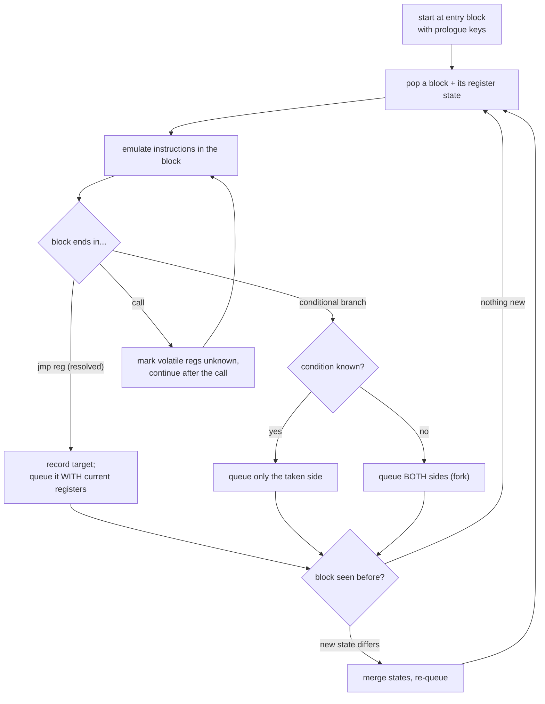

Four design decisions in that loop are worth calling out, because each one is
there to handle a specific variant:

- **State travels with the edge.** When a resolved jump targets a new block, the
  current register values are queued *with* it. That is what carries a key — or a
  per-block decode offset — from where it is set to where it is used.
- **Joins merge by agreement.** If two paths reach the same block with different
  values for a register, that register becomes unknown (`None`) there. Only facts
  that are true on *every* path into a block survive. This keeps the analysis
  sound at the cost of occasionally giving up a resolution.
- **Only reachable code is explored.** Because the walk starts at the entry and
  only follows branches it can actually take, the dead false-branch gadgets are
  never visited. This is exactly why, on `reg_read_str`, the isolated resolver
  reports **109** indirect jumps but the fixpoint reports **82**: the 27-jump
  difference is dead opaque-predicate gadgets that the real program never runs.
- **Calls poison volatile registers.** A normal `call` can clobber the Win64
  *volatile* registers (`rax`, `rcx`, `rdx`, `r8`–`r11`), so after a call the
  emulator marks those unknown. **Except** for stack-probe helpers (`__chkstk`,
  `alloca`): those only adjust the stack and preserve every general register, and
  the obfuscator deliberately straddles a decode gadget across such a probe. If
  we treated them like normal calls we would throw away a live key and fail to
  resolve. `reg_read_str` contains **3** of these transparent calls, so this is
  not a hypothetical edge case — it is required to resolve the function at all.

The analyzer's verdict for each indirect jump is one of: **resolved** (exactly
one target — patch it), **conflict** (different paths gave different targets —
refuse, it isn't a single static edge), **switch** (a real compiler jump table —
leave it alone), **not-on-an-instruction** (target lands inside hidden bytes —
see below), or **unresolved** (left as-is).

#### 3.1.5 Rewriting the jump safely (the patcher)

Knowing the target is only half the job. Now we replace the computed jump with a
direct one — `E9 <rel32>`, a 5-byte instruction — **without disturbing anything
the function still needs**. This is where the variants get physical, because we
are editing bytes in place. The patcher has two strategies and picks the first
that is provably safe.

**Strategy A — overwrite the dead tail (`_tail_span`).** In the common case the
instructions right before `jmp rax` are pure decode arithmetic that is now dead
(nobody reads `rax` again except the jump we're replacing). The patcher extends
backwards from the jump over **tail-safe** instructions (`add`/`mov`/`lea`/`nop`)
until it has at least 5 bytes, writes the direct jump there, and pads the
leftover with `nop`. Every instruction in the span must be tail-safe or it
refuses.

**Strategy B — relocate the survivors (`_plan_reloc`).** Sometimes a *live*
instruction sits between the decode writer and the jump — for example argument
setup like `mov r8,[rbp+..]` or a state write that the real code still needs.
Overwriting it would corrupt the program. Instead the patcher walks back and
classifies each instruction:

- A **droppable writer** — one that merely recomputes the jump register — is
  discarded to reclaim space.
- Anything else is a **survivor**: its bytes are preserved and shifted down, and
  the direct `jmp` is appended after them.

If the survivors plus the 5-byte jump don't fit, or any survivor isn't safe to
move, the patcher **refuses** that jump rather than risk a bad edit.

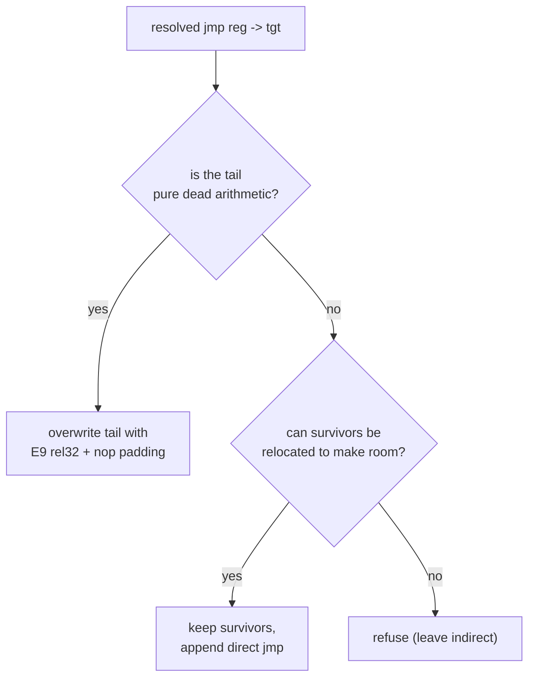

Two more wrinkles complete the picture:

- **Revealing hidden code (`_can_promote` / promote).** When a target lands on
  bytes IDA never disassembled — because no edge ever reached them — the patcher
  first checks (non-destructively) that those bytes decode to a valid
  instruction, then *materializes* them into code so the new direct edge has a
  real landing site. Obfuscated code is full of these "hidden" blocks that only
  become visible once you give them an entry.

- **Multiple rounds (`patch`, up to 5).** Materializing hidden blocks can expose
  *new* gadgets that were invisible before, which a further pass can now resolve.
  So the patcher loops: analyze → patch → re-analyze, stopping as soon as a round
  patches nothing new or reveals no new code. It converges quickly — most
  functions finish in one or two rounds.

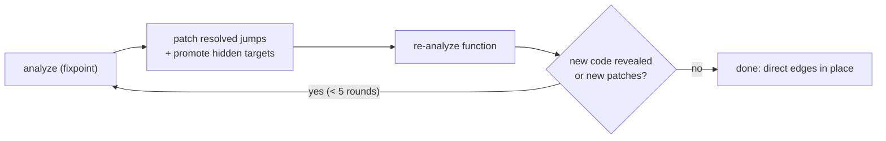

**Why this is conservative by design.** At every step where the plugin is not
*certain* — an unknown register, a conflicting target, a survivor it can't safely
move — it declines to patch and leaves the original indirect jump in place. A
function that is partly de-indirected is still analyzable; a function that has
been mis-patched is destroyed. The whole layer is tuned to prefer the former.
This is the same "correct, not clever" stance you saw in Part 2, now visible in
the code.

---

### 3.2 Layer 2 — Unflattening the state machine

**Recap of the target.** After Layer 1 reconnects the fragments, the function
still isn't readable: it has been turned into a **state machine**. The real
blocks no longer fall into each other in program order. Instead, each block ends
by writing a number — its *next state* — into a slot, then jumps back to a
central **dispatcher** that reads the number and routes to whichever block owns
it (Part 1.4). The decompiler sees a giant `while(1) { switch(state) { … } }`
hairball instead of a flow chart. Layer 2's job is to discover, for each block,
which block *really* comes next, and rewrite the state-write so the block jumps
straight there — making the dispatcher dead and the flow chart reappear.

This is the most involved layer, so we break it into four problems and solve them
in order:

1. **Find the machine** — which register/slot is the "state", and what is the
   map from each state number to its block?
2. **Understand the decode** — where does the state actually live in memory, so
   we can read it the way the program does?
3. **Resolve each hop** — from a block, where does control *really* go next?
4. **Rewrite** — turn each state-write into a direct jump, then clean up.

Throughout, we use `reg_read_str` again. Its real, recovered facts (read live
from the database) are: the state register is **`eax`**, there are **28 states**
wired together by a **39-comparison** dispatcher tree, the entry state is
**`0xD5FD561C`**, and the state value is decoded from the global at
`off_140307B20` using the key in `r15` (`0x489B85B10A15A8C7`).

#### 3.2.1 Finding the state machine (`StateMachine`)

The first task is to identify the **state register** without knowing anything
about this particular obfuscator's layout. The plugin uses a value-overlap trick
that is beautifully robust:

- The dispatcher is a binary search tree of `cmp <reg>, <constant>` instructions —
  it compares the *state register* against the list of valid state numbers.
- Every real block, when it picks its successor, **stores one of those same
  constants** into memory.

So the plugin collects two sets: every constant compared against each register,
and every constant stored to memory. **The register whose compare-constants
overlap the stored-constants the most is the state register.** No reliance on a
specific stack offset or addressing form — just the values. (It requires an
overlap of at least 3 to avoid coincidences.) For `reg_read_str` the winner is
`eax`.

With the state register known, it walks the dispatcher and builds the
**backbone** — the map `state number -> block head` — by reading each leaf of the
search tree: `cmp eax, STATE ; jz TARGET` means "state `STATE` lives at
`TARGET`". It also filters out decoys: small constants (like a `cmp eax, 0x20`
that's really comparing a character) that accidentally reuse the state register
are dropped, because real state numbers are large random 32-bit values and each
owns a unique block.

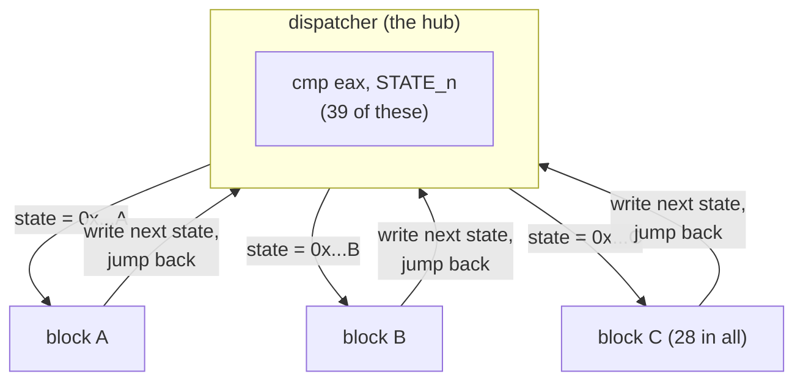

A function is only treated as flattened if it has enough states **and** enough
distinct target blocks — this avoids mistaking an ordinary compiler `switch`
(many cases sharing a few targets) for the obfuscation.

#### 3.2.2 Understanding the decode: where the state lives

To resolve a hop we must *read the state the way the program does*. In this
sample the state is not a simple stack variable — it is kept in a global buffer,
and the address is itself obfuscated:

```asm
mov  rbx, cs:off_140307B20     ; base pointer from a global
mov  eax, [rbx + r15]          ; state = *(base + key)    (r15 = 0x489B85B10A15A8C7)
```

The plugin recovers the **base global** (`off_140307B20`) and the **key
register** (`r15`), reads the base value out of the file, adds the key, and gets
the real address of the state cell — for `reg_read_str` that is `0x14035C70C`.
Two neighbouring globals (at base+8 and base+16) decode the same way into an
"operand" buffer and the computed-goto **jump table**. These three regions are
recorded as **trusted memory** — addresses that belong to the dispatcher
machinery rather than to the program's real data. (That distinction is the key to
the next step.) The plugin handles three families of this layout: the **global
base+key** form above, a **stack-mirror** form where the state is also written to
a stack cell, and a **dynamic stack-slot** form addressed through a pointer
register. `reg_read_str` is the stack-mirror family.

#### 3.2.3 The crux: telling opaque branches from real ones (`EmuM`)

Here is the central difficulty of unflattening. When we emulate a block to find
its successor, we hit branches. Some are the obfuscator's **opaque predicates**
(fake — always go one way) and must be *folded* to their single real direction.
Others are the **program's own** conditionals (`if (error) …`) and must be
*kept* — both directions are real successors. Get this wrong and you either leave
fake clutter or, far worse, silently delete a real edge.

The plugin's resolver emulator (`EmuM`) extends the Layer 1 emulator with two new
abilities:

- **A memory model.** It records stores and serves loads — including reading the
  real bytes of the trusted dispatcher tables — so the state value the block just
  wrote is the value the dispatcher reads back.
- **A taint model.** Every value is tagged *trusted* (derived from dispatcher
  machinery / decode keys / constants) or *tainted* (derived from real program
  data — a return value, a memory read of actual data). Taint propagates through
  the arithmetic, so by the time a `cmp` sets the flags, the emulator knows
  whether that comparison is looking at machinery or at real data.

That single bit — *was the branch condition computed from real data?* — is the
decision rule:

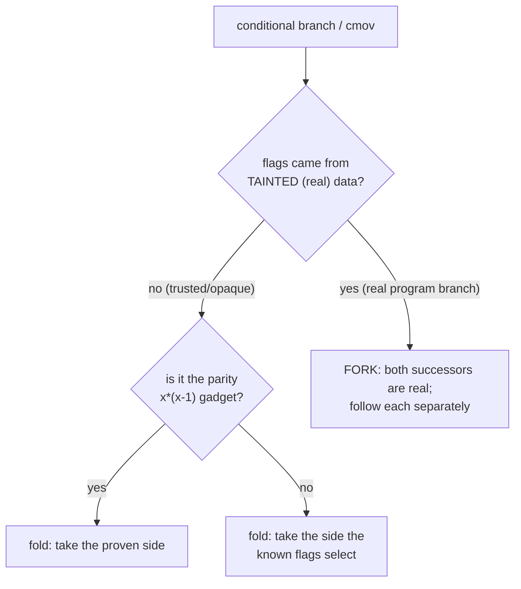

The parity opaque (`lea r,[x-1]; imul r,x; test r,1; jz …` from Part 1.5) gets
special structural recognition: because `x*(x-1)` is *always even*, that branch
is provably one-directional regardless of any value, so it is folded even when
its input is tainted. This recognition is what stops a tainted-but-fake branch
from forking into an impossible path and exploding the search.

#### 3.2.4 Resolving one hop at a time (`PerHopResolver`)

The clever simplification at the heart of Layer 2 is the **per-hop** view.
Rather than try to simulate the whole machine at once, the plugin resolves each
state *independently*: start at that state's block, emulate forward — folding
opaque navigation, forking only on genuine (tainted) decisions, stopping the
instant the path reaches a **state-slot write**. The value written is the next
state. That's one hop.

Each hop is then **classified**:

| Classification | Meaning | What we do |
| --- | --- | --- |
| `uncond` | all paths write the same next state | rewrite to one direct jump |
| `cond` | exactly two next states, chosen by one tainted `cmov`/branch | rewrite to `jcc` + `jmp` |
| `relay` | reached the next block with no write of its own | compose it away |
| `ret` | the path reaches a real function return | leave it (already terminal) |
| `nway` / `multi` | a >2-way real branch (e.g. a character classifier) | only kept if it already jumps to real blocks; else left dispatching |
| `bad` | unresolved within budget, or an unmodelled computed goto | **leave dispatching** (safe residual) |

Why per-hop is sound: the obfuscator's own dispatcher would have done exactly
this routing — read the state the block wrote, jump to that block. Replacing the
write with a direct jump to the same destination is *locally equivalent*. So the
plugin can patch the edges it can prove and leave any stubborn block still going
through the (intact) dispatcher — a small correct residual instead of an
all-or-nothing failure.

Every hop runs under strict budgets (instruction count, fork count, and a
wall-clock limit per hop and per function) so a pathological block can never hang
IDA — it just gets marked `bad` and left alone.

Finally the resolver finds the **entry state** — either by tracing the prologue
to its first state-write (for `reg_read_str`, the entry state `0xD5FD561C` is
written at `0x140088AF9`, an instruction you can see right in the prologue dump
from §3.1.2), or, when the prologue seeds the slot indirectly, by finding the one
state in the recovered graph that reaches all the others. From the entry it walks
the recovered edges to compute the **live** set — the blocks that actually run.
Everything not reachable is dead opaque-gadget scaffolding that Hex-Rays will
drop on its own.

> **The order dependency, made concrete.** Run this same resolver on a *pristine*
> IDB — before Layer 1 — and it still finds the whole structure (28 states, the
> entry `0xD5FD561C`, the decode key) but reports **1 live block, classified
> `bad`**. With no direct edges yet, the per-hop emulation can't walk from one
> block to the next, so nothing resolves. After Layer 1 lays down the direct
> edges, the same code resolves the live graph cleanly. This is exactly why
> Layer 1 must run first.

#### 3.2.5 Rewriting the edges (`PerHopPatcher`)

Now we turn classifications into bytes. The transforms are small:

- **Unconditional hop:** overwrite the `mov [state_slot], next_state` with
  `jmp <block of next_state>`.
- **Conditional hop:** overwrite the selecting `cmov` region with
  `jcc <true block>` followed by `jmp <false block>`.

**"But what about the instructions in between?"** A fair worry: the `mov` that
writes the next state usually isn't the very last byte of the block — a few more
instructions sit between it and the jump back to the dispatcher. If we drop our
direct `jmp` right on the state-write, don't those trailing instructions get
skipped? They do — and that's exactly what we want, *because of what they are*.
In this obfuscation a block's last real act is to pick its next state; everything
after that is pure bookkeeping to get back to the dispatcher (recomputing the
dispatcher's address and jumping to it). Once our block jumps straight to its real
successor, the dispatcher is out of the loop, so that bookkeeping is dead by
definition. The patcher therefore doesn't just stamp 5 bytes and leave a mess: it
overwrites the whole run from the state-write through that final jump (filling any
slack with `nop`s), so nothing is left half-reachable. And it only does so within
a region it has proven is **block-private** — it stops the moment it would touch a
byte that some other block jumps to, or any dispatcher instruction. If real work
ever sat in that tail, the region would end early and there'd be no room; rather
than risk clipping a live instruction, the patcher simply **refuses** and leaves
that block dispatching (more on this refuse-don't-guess stance below).

The messiness is *room*. A direct jump needs 5 bytes; a conditional needs 11. The
state-write site is often smaller. So the patcher has a ladder of strategies, in
order of preference, each used only when it is provably safe:

1. **Patch in place** if the site's block-private region is big enough.
2. **Reclaim the dead state-value computation.** The instructions that built the
   state constant (`mov dst, K`, the `cmov`s) are dead once we branch directly, so
   the patcher walks back over them — strictly register-only writes, never real
   work or memory — and anchors the jump there for more room.
3. **Patch in the originating block.** When a `cmov` discriminator is a *shared*
   gadget reached by several states, the real per-state decision lives back in
   that state's own block; the patcher anchors there.
4. **Relocate to a code cave.** For an "OR-of-cmov" chain (several `cmov`s
   selecting one value) that can't fit inline at all, the patcher emits the whole
   decision into spare padding at the end of the code section and jumps to it,
   then attaches that cave as a function tail so Hex-Rays decompiles it inline.

If none of these can place a correct patch, the edge is **refused** and that
block is left dispatching.

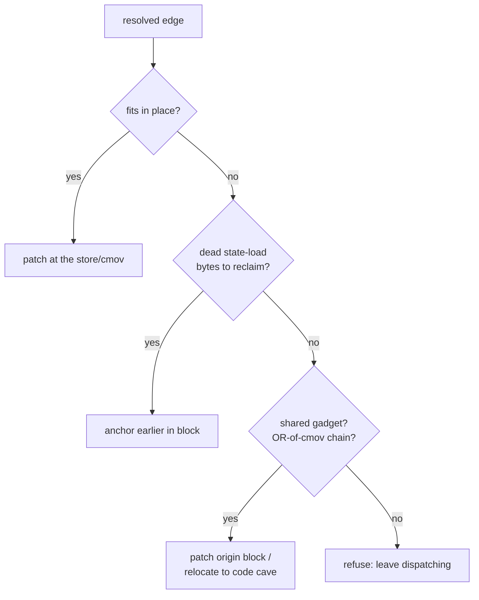

**Two whole-function safety gates** sit above all this:

- **Decoy detection.** In the jump-table family, some functions present a tiny
  "entry" path that does no real work while the real body (dozens of API calls)
  hides behind a computed-goto the resolver can't follow. Patching that would
  reduce the function to a stub, so such decoys are detected (live path has zero
  real calls, dead component has many) and **left untouched**.
- **All-or-nothing for the jump-table family.** That family shares one
  computed-goto dispatcher across every state, so a single unresolved block keeps
  the whole flattening alive — a partial patch would make things *worse*. There,
  the plugin patches only if it can resolve and place **every** live edge;
  otherwise it leaves the function at Layer 1. (The stack-mirror family, like
  `reg_read_str`, dispatches per-block, so partial patching is safe and is
  allowed.)

#### 3.2.6 The finishing pass: folding opaque predicates (`OpaqueFolder`)

After the edges are rewritten, each real block still carries the dead parity
gadget that used to gate it. Left alone, Hex-Rays renders these as spurious
`if`/`while` noise. The `OpaqueFolder` makes one last structural sweep over the
function and rewrites every parity branch to its proven outcome:

- `jz`/`je` (always taken) → a direct `jmp` to the target.
- `jnz`/`jne` (never taken) → `nop`s (fall through).

Because `x*(x-1)` being even is an algebraic certainty — not a guessed value —
this rewrite is provably correct. The now-dead parity arithmetic feeds nothing,
Hex-Rays drops it, and the spurious branches vanish. This same fold is also used
as a **standalone fallback** for the dynamic-stack-slot family, where full edge
recovery isn't possible but folding the opaque maze alone still collapses most of
the clutter into a readable loop.

**The outcome.** With the live edges direct, the dispatcher unreferenced, and the
opaque branches folded, `reg_read_str`'s 28-state hairball collapses back into the
small tree of real logic from Part 1.3 — open key, read value, close key, with
one fallback path.

---

### 3.3 Layer 3 — Naming the blinded API calls

**Recap of the target.** Every external call is hidden behind additive
**blinding**: the program never names the function it calls. Instead it loads a
scrambled value from a global, adds a secret key, and calls the result. In the
listing you see an anonymous `call rax` and have no idea the program just opened a
registry key. Layer 3 undoes the arithmetic and writes the real name next to the
call — in both the disassembly and the decompiled C.

This layer is read-mostly (it only adds comments, never patches code), but it is
sneaky in its own right because the blind comes in several shapes and the key
isn't always sitting nearby.

#### 3.3.1 The shape of the blind

The canonical form, straight from `reg_read_str`, is two instructions feeding a
later call:

```asm
140089013  mov  rax, cs:off_140303D20    ; rax = V  (a scrambled "directory value")
14008901a  add  rax, rdx                 ; rax = V + key
   ...                                    ; load args: HKLM, subkey, 0, KEY_READ
14008903e  call rax                      ; -> the real API
```

The two ingredients are:

- **V — the directory value.** A large 64-bit constant stored in a global data
  slot (`off_140303D20`). Here `V = 0x8DE7E6F45580BB5C`. It is *not* a valid
  address on its own — that is the point.
- **key — a per-family secret.** A large 64-bit constant the program keeps in a
  register. In this call the key is in `rdx`, and its value is
  **`0x7218190CEAADE73C`**. Look familiar? It is one of the very constants the
  prologue loaded in §3.1.2 (it was `r12` there). The same family of keys drives
  both the jump decoding and the call blinding.

Add them: `0x8DE7E6F45580BB5C + 0x7218190CEAADE73C = 0x1402EA298`, which is the
import slot named **`RegOpenKeyExA`**. Mystery call solved. (A variant adds one
more `mov rax,[rax]` so the sum is a *pointer* to the target rather than the
target itself; the plugin handles both, tracking the number of dereferences.)

#### 3.3.2 Harvesting the keys (`collect_keys`)

Because every key is a large constant some instruction loads into a register, the
plugin simply harvests **every immediate larger than 32 bits that is moved into a
64-bit register, anywhere in the binary**. In this sample that yields **1,358
candidate keys**. Most are irrelevant; the trick (next) is letting the *correct
answer pick the key* rather than trying to know in advance which constant is "the"
key for a given call.

#### 3.3.3 Two complementary resolvers

A single strategy doesn't catch every call, so the plugin runs several and unions
the results per call site.

**(a) Per-call backward trace (`Resolver` + `Emu`).** Starting at the call, the
plugin follows the *unique* chain of predecessor instructions backward (through
unconditional jumps, stopping at any real merge) to find where the target
register was built, then emulates that straight-line slice forward with a small
constant emulator. The emulator carries an unknown key symbolically as a
`Blind(V)` value. At the call it *pins* the key: it tries the candidate keys and
keeps the one for which **`V + key` lands on a real function start or a named
import** — a constraint a wrong key essentially never satisfies. This is how the
`RegOpenKeyExA` example above resolves.

**(b) Family-key blind map (`build_blind_map`).** Sometimes the key is never a
local literal — it's inherited from a caller or computed — so the per-call trace
can't see it. This resolver is **key-agnostic and global**. It collects *every*
blinded directory value `V` in the image, then asks: which candidate key, when
added, turns **at least 4 different `V`s** into valid targets at once? A key that
satisfies a whole *family* of values is the real key; a coincidence can't line up
four independent values. In this sample **11 family keys** are confirmed this
way, and they resolve **411 distinct directory values** to names. Each value then
folds to its name wherever it is loaded, no matter how far the call is from the
load.

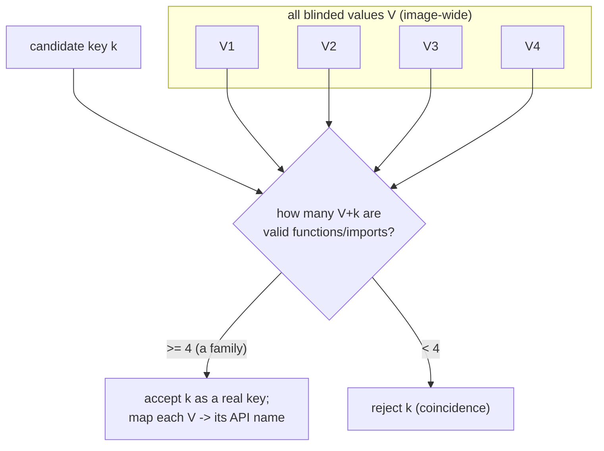

Two more passes (a decompiler-ctree folder and an import-directory peephole)
mop up calls whose pointer is relayed through a stack buffer that Hex-Rays has
already simplified, or whose import slot is filled only at runtime. Their results
are merged in, never overwriting a name another pass already found.

#### 3.3.4 From address to name (`sym_for` / `_named_import`)

Once `V + key` produces an address, the plugin maps it to a human name. The
target can be one of three things:

- a **function start** in code → its name;
- a classic **`__imp_<API>` IAT thunk** → the API name;
- a **runtime-filled import slot** in `.bss` that IDA labels **`p_<API>`** → the
  API name. These slots are written by the loader at run time, so their contents
  are `0xFF` in the static file — but the *slot's own label* carries the API name,
  so the call is still resolvable even though the pointer value isn't present yet.

#### 3.3.5 Writing the annotations (`_set_pseudo_cmts`)

Annotation happens in two places, because they have different reliability:

- **Disassembly comments** are attached to the call/load instruction's address —
  always a real address, so this is complete and reliable.
- **Pseudocode comments** can't be anchored to the call instruction's address:
  the obfuscator splits the target-load from the call, and Hex-Rays usually drops
  the raw call address from its tree (the comment would become an "orphan"). So
  the plugin instead anchors each name to the **enclosing C statement**, which is
  always a stable tree item, and merges multiple calls on one line into a single
  annotation.

For idempotency, before writing it **clears every stale `-> name` comment** it
finds in the function's comment store — so re-running, or running after coverage
changes, never leaves duplicate or contradictory annotations behind.

#### 3.3.6 Honesty about limits

A handful of calls use a key that genuinely cannot be recovered without running
the program (it isn't a constant anywhere and isn't shared by a family). The
plugin leaves those unlabeled rather than guess. As with the other layers, a
missing annotation is acceptable; a wrong one is not.

---

### 3.4 How the layers share machinery

A closing note on the engineering. The three layers are separate passes, but they
deliberately reuse each other's parts rather than reinvent them:

- Layer 2's resolver emulator (`EmuM`) **subclasses** Layer 1's emulator (`Emu`),
  adding the memory and taint models on top of the same instruction semantics.
- Layer 2 reuses Layer 1's register-init scan, register-canonicalisation, and
  transparent-call list.
- The **parity opaque predicate** (`x*(x-1)` is even) is recognised in three
  places — Layer 1's resolver folds it while resolving jumps, Layer 2's per-hop
  emulator folds it while resolving hops, and Layer 2's `OpaqueFolder` physically
  rewrites it at the end — all from the same algebraic fact.
- The **keys** the prologue loads (§3.1.2) are simultaneously Layer 1's jump-
  decode keys, Layer 2's state-decode key, and Layer 3's call-blind keys. One set
  of constants, three uses — which is exactly why recovering them once pays off
  across the whole pipeline.

This shared core is what keeps the plugin small enough to audit while still
handling the messy variety of a real obfuscated binary.

---

## Part 4 — Plugin architecture and code walkthrough

Part 3 covered the *engines* — the algorithms that resolve jumps, unflatten state
machines, and de-blind calls. This part covers everything *around* them: how the
code is organised, how a click in IDA's menu becomes a multi-pass run, and how
the plugin stays safe to re-run. If Part 3 was the "what it computes," this is the
"how it's wired."

### 4.1 The layout

The whole plugin is one entry-point file plus a small package, living side by side
in IDA's `plugins` folder:

```text
plugins/ida/
├── cff_deobfuscator.py     # the IDA plugin (menu, dialogs)        ~144 lines
├── ida-plugin.json         # Plugin Manager metadata
├── install.py              # cross-platform installer
├── README.md
└── cff/                    # the engine package
    ├── __init__.py         # package marker + version            ~17 lines
    ├── orchestrator.py     # the multi-pass driver               ~182 lines
    ├── runstate.py         # idempotency / resume state          ~121 lines
    ├── log.py              # uniform console output              ~56 lines
    ├── layer1.py           # Layer 1 engine                    ~1,038 lines
    ├── layer2.py           # Layer 2 engine                    ~2,676 lines
    └── imports.py          # Layer 3 engine                    ~1,317 lines
```

The split is deliberate: the three engines are **plain libraries** with no UI code
in them, and everything user-facing (menus, dialogs, progress, state) lives in
the thin top layer. You can `import cff.layer1` from the IDA console and drive any
single function by hand, exactly as we did throughout Part 3, without the plugin
ever being involved.

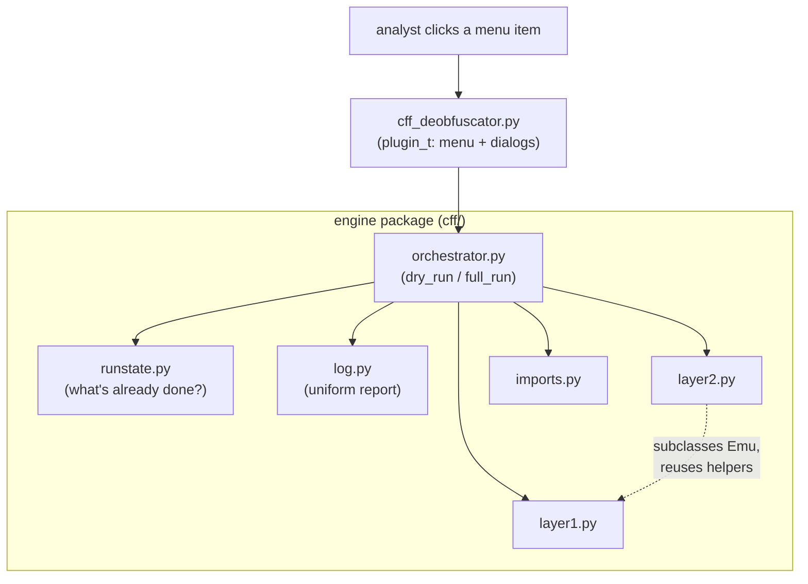

### 4.2 Component walkthrough

#### `cff_deobfuscator.py` — the IDA plugin

This is the only file IDA loads directly. It is intentionally tiny and does four
things:

1. **Makes the package importable.** IDA may load the entry file from various
   working directories, so the first thing it does is add its own directory to
   `sys.path` so `from cff import …` always works:

```python
_DIR = os.path.dirname(os.path.abspath(__file__))
if _DIR not in sys.path:
    sys.path.insert(0, _DIR)
```

2. **Imports the engine lazily.** The orchestrator (and through it Hex-Rays) is
   imported only when an action actually fires, not at load time, so an IDA
   without the decompiler gives a clean error message instead of a load-time
   traceback.

3. **Registers exactly two actions** — *Dry run (report only)* and *Full run
   (patch + annotate)* — and attaches them under `Edit > Plugins`. Registration is
   **idempotent**: it unregisters any existing action of the same id first, so
   reloading the plugin during development never throws "action already exists."

4. **Guards the destructive path.** The full run pops a confirmation dialog
   (defaulting to *No*) before touching the database, and both actions wrap the
   engine call in a `try/except` that surfaces any failure as an IDA warning
   dialog rather than a silent console traceback.

The class itself is the standard IDA shape — `plugin_t` with `init` / `run` /
`term`. `init` returns `PLUGIN_KEEP` so the plugin stays resident and the menu
items persist; `run` (invoked if the user triggers the plugin directly) offers
the same two choices via a three-button dialog.

#### `orchestrator.py` — the multi-pass driver

This is the brain. It exposes the two functions the plugin calls — `dry_run()`
and `full_run()` — and nothing else needs to know how the layers fit together.

**`full_run()`** is a resilient, idempotent pipeline:

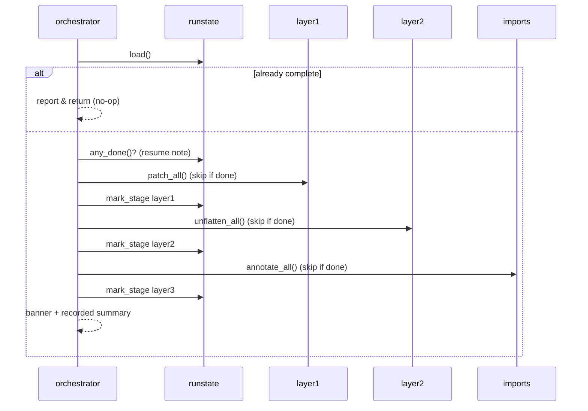

Each stage is a small wrapper (`_stage_layer1/2/3`) that follows the same
pattern: *check whether this stage is already recorded as done → if so, skip with
a message → otherwise run the engine, record the result, and print a one-line
summary*. Because each stage is marked complete the instant it finishes, a run
that is interrupted (or crashes) after Layer 1 resumes cleanly at Layer 2 the next
time, and a fully-finished database is left completely untouched.

**`dry_run()`** mirrors the same three stages but calls each engine's **read-only**
report path (`L1.report_all()`, `L2.report_all()`, `L3.annotate_all(apply=False)`)
and writes nothing. It honestly states its own caveat in the output: the figures
reflect the database's *current* contents, so on an un-deobfuscated IDB the Layer
2/3 numbers are estimates (the exact reason explored in Part 2.1 and §3.2.4).

The rest of the file is **stat summarizers** — little functions that flatten each
engine's native return value into a uniform dict — and a recorded-results printer.
That is the orchestrator's whole job: sequence, gate, summarize. It contains no
deobfuscation logic of its own.

#### `runstate.py` — idempotency and resume

This is what makes re-running safe. The byte-patching passes are **not** safely
repeatable — running Layer 2 again over an already-unflattened function could wire
up a wrong edge — so the plugin records its progress and consults it before
patching.

The state is a tiny JSON blob stored in a **private netnode** named
`"$ cff-deobfuscator"` (the leading `$` keeps it out of IDA's names list). It
records a schema version, the plugin version, timestamps, and a per-stage record
of `{done, finished, stats}`. The public helpers are deliberately small:
`load()`, `mark_stage()`, `is_complete()`, `any_done()`, `stage_done()`, and a
`reset()` to force a fresh run. Everything is wrapped so that a missing or
unreadable blob simply reads as "never processed" — the plugin degrades to
re-doing work rather than ever crashing on bad state.

The netnode lives **inside the IDB**, so the record travels with the database: the
"already done, skipping" behavior works across IDA restarts, not just within one
session.

#### `log.py` — one voice for the whole run

A 56-line module with a small, uniform status vocabulary — `banner`, `stage`,
`info` (`[*]`), `ok` (`[+]`), `warn` (`[!]`), `skip` (`[-]`) — that writes to
IDA's Output window (falling back to `print` outside IDA). The engines still emit
their own detailed `[layer1]`/`[layer2]` lines; this module just wraps the whole
thing in consistent banners so a full run reads as a single coherent report.

#### The engine library surface

Although Part 3 dug into their internals, each engine also presents a clean,
whole-binary API that the orchestrator drives:

| Engine | Read-only | Apply |
| --- | --- | --- |
| `layer1` | `report_all()` | `patch_all()` |
| `layer2` | `report_all()` | `unflatten_all(do_apply=True)` |
| `imports` | `annotate_all(apply=False)` | `annotate_all(apply=True)` |

A couple of shared engine utilities are worth knowing:

- **Flattened-function discovery** (`layer1.find_flattened_functions`) — the cheap
  heuristic (a function with many `jmp <reg>`) that both Layer 1 and the
  orchestrator use to decide what to work on.
- **Cancelable progress** (`layer1._run_over_flattened`) — runs a worker over
  every flattened function behind IDA's wait box, checking for user-cancel
  **between functions only**, so cancelling never leaves a function half-patched.
- **Decompiler headroom** (`layer1.ensure_decompiler_limit`) — de-flattened
  functions stay physically huge, so this raises Hex-Rays' `MAX_FUNCSIZE` past the
  64 KB default to cover the binary's largest function; otherwise large functions
  would fail to decompile after a successful unflatten.

### 4.3 Cross-cutting design themes

A few principles show up in every component, and they are what make the plugin
trustworthy on a real sample:

- **Correct-not-clever / fail-safe.** Every engine refuses rather than guesses
  (Part 3): unknown register → no patch, conflicting target → no patch, unprovable
  edge → leave dispatching. A partial result is always preferred over a wrong one.
- **Idempotent and resumable.** Action registration, stage execution, and the
  netnode state are all written so that running twice is either a clean skip or a
  clean resume — never a double patch.
- **Read/apply symmetry.** Each layer has a read-only path and an apply path that
  share the same analysis, so the dry run genuinely previews the full run.
- **Bounded work.** Per-hop, per-function, and per-call budgets (step counts and
  wall-clock limits, Part 3.2) guarantee a pathological function degrades to
  "left dispatching" instead of hanging IDA.
- **Lazy, side-effect-free imports.** Engines are plain libraries; the heavy /
  Hex-Rays-dependent imports happen only when an action runs.

### 4.4 Packaging and installation

Two files make the plugin installable the modern way:

- **`ida-plugin.json`** is the IDA 9.x Plugin Manager descriptor. It names the
  entry point (`cff_deobfuscator.py`), the version, the supported IDA versions,
  and a description/keywords, so a user can drop the folder in and have IDA
  discover it automatically.
- **`install.py`** is a small cross-platform installer. It locates the IDA user
  directory (`$IDAUSR`, else the platform default — `%APPDATA%\Hex-Rays\IDA Pro`
  on Windows, `~/.idapro` on Linux/macOS), then copies the three payload items —
  the entry file, the manifest, and the whole `cff/` package — into
  `plugins/cff-deobfuscator/`, skipping `__pycache__`. It supports `--uninstall`
  and a `--dir` override, and a re-install cleanly replaces the previous copy.

```bash
python3 install.py              # install / upgrade
python3 install.py --uninstall  # remove
python3 install.py --dir PATH   # install into a specific IDA user dir
```

After installation the two actions appear under **Edit > Plugins > CFF
Deobfuscator: …**, and the whole pipeline from Parts 1–3 is one click away.
